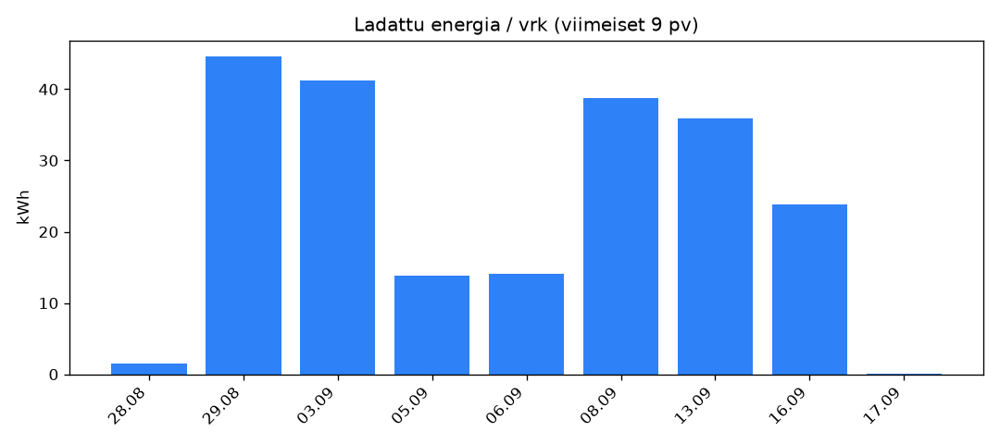

# go-e Charger -looginen loki

Kerää oman go-e-latauslaitteen tehotiedot säännöllisesti, jotta latausta
voi myöhemmin verrata pörssisähkön tuntihintoihin.

<!-- SUMMARY_START -->
### 📊 Latausdatan yhteenveto

_Päivitetty automaattisesti: 01.09.2026 klo 02:00 (UTC)_

_Kustannus lasketaan varttitasolla (15 min) todellista kulutusta vastaan, samalla tavalla kuin sähköyhtiö laskuttaa 1.10.2025 alkaen - ei tunnin sisäisten varttien tasapainoista keskiarvoa._

_Energialukujen skaalaus kalibroitiin 28.8.2026 tunnettua mittarilukemaa vasten (ks. goe_logger.py:n kommentit)._

- **Yhteensä ladattu:** 46.1 kWh (28.08.2026 – 29.08.2026)
- **Viimeiset 24 h:** 46.12 kWh
- **Viimeiset 7 vrk:** 46.12 kWh
- **Keskiarvo / vrk:** _lasketaan kun dataa on kertynyt vähintään vuorokausi (nyt 6.0 h)_

- **Pörssisähkön kustannus (spot + marginaali 0.39 snt/kWh + ALV 25.5%):** 0.34 € (0.74 snt/kWh, kulutuspainotettu keskihinta)
  <br>_josta pelkkä spot-hinta (ilman marginaalia/ALV:tä): 0.20 snt/kWh_



_Tarkka tuntikohtainen data: [`tuntikohtainen.csv`](./tuntikohtainen.csv). Kustannukset: [`kustannukset.csv`](./kustannukset.csv). Raakadata: [`goe_log.csv`](./goe_log.csv)._
<!-- SUMMARY_END -->

## 1. Hae API-tunnukset

1. Avaa go-e-sovellus.
2. Mene **Internet / Advanced Settings** (tai "Erweiterte Einstellungen").
3. Aktivoi **Cloud API** ("cae" = true).
4. Sieltä löytyvät:
   - **sarjanumero** (6-numeroinen, laitteen takana / sovelluksessa)
   - **API-token** ("cloud api key" / "cak")

## 2. Aja GitHub Actionsissa (suositeltu — ei omaa laitetta tarvita)

Tämä on helpoin tapa, koska GitHub ajaa skriptin puolestasi pilvessä
ajastetusti, eikä oma koneesi tarvitse olla koskaan päällä.

1. **Luo GitHub-repositorio** (voi olla julkinen tai yksityinen) ja
   vie tämän kansion tiedostot sinne:
   - `goe_logger.py`
   - `.github/workflows/goe-logger.yml`
   - (ei `config.json`-tiedostoa — tunnukset menevät Secrets-asetuksiin, ks. alla)

   ```bash
   git init
   git add goe_logger.py .github
   git commit -m "Alusta go-e logger"
   git branch -M main
   git remote add origin https://github.com/KAYTTAJANIMI/REPO-NIMI.git
   git push -u origin main
   ```

2. **Lisää tunnukset Secrets-asetuksiin** (EI koodiin, EI config.json:iin):
   - Mene repo → **Settings** → **Secrets and variables** → **Actions**
   - Klikkaa **New repository secret** ja lisää kaksi salaisuutta:
     - `GOE_SERIAL` = laitteesi sarjanumero
     - `GOE_TOKEN` = go-e Cloud API -token

3. **Varmista, että Actions on päällä**:
   - Repo → **Actions**-välilehti → jos GitHub kysyy, ota työnkulut käyttöön.
   - Workflow (`goe-logger.yml`) ajaa itsensä automaattisesti 15 minuutin
     välein (`cron: "*/15 * * * *"`). Voit myös käynnistää sen heti
     käsin: Actions-välilehti → "go-e charger logger" → **Run workflow**.

4. **Data kertyy `goe_log.csv`-tiedostoon suoraan repoon** — jokainen
   ajastettu ajo lisää siihen rivin ja committaa muutoksen automaattisesti
   (`goe-logger-bot`-nimisenä committina). Voit seurata kertymää suoraan
   GitHubin selainnäkymästä tai kloonata repon paikalliseksi milloin vain.

**Huomioita GitHub Actionsista:**
- Ilmaisilla julkisilla repoilla Actions-minuutit ovat rajattomia; yksityisillä
  repoilla on kuukausittainen ilmainen kiintiö (tähän käyttöön riittää
  reilusti — yksi ajo kestää sekunteja).
- GitHub poistaa käytöstä ajastetut workflow't, jos repossa ei ole ollut
  MITÄÄN commit-aktiviteettia 60 päivään. Koska tämä workflow itse committaa
  dataa 15 min välein, tämä ei ole ongelma niin kauan kuin se pysyy käynnissä.
- Cron-ajoitus ei ole sekunnilleen tarkka ruuhka-aikoina — tuntitason
  analyysiin tämä ei haittaa.
- `.gitignore`-tiedostoon kannattaa lisätä `config.json`, jos joskus
  kokeilet myös paikallista ajoa samassa repossa — token ei saa koskaan
  päätyä committiin.

## 3. Vaihtoehto: aja paikallisesti (esim. myöhemmin Raspberry Pi:llä)

```bash
python3 -m venv venv
source venv/bin/activate   # Windows: venv\Scripts\activate
pip install requests       # ei pakollinen, skripti käyttää vain urllib:ia
```

Skripti ei vaadi kolmannen osapuolen kirjastoja — pelkkä Python 3 riittää.

### Konfiguroi

```bash
cp config.example.json config.json
```

Täytä `config.json`:
```json
{
  "serial": "123456",
  "token": "oma-token-tähän",
  "poll_interval_seconds": 60
}
```

`config.json` sisältää salaisen tokenin — älä jaa sitä tai vie
versionhallintaan (jos julkaiset koodin GitHubissa, lisää
`config.json` `.gitignore`-tiedostoon; vain `config.example.json`
kuuluu julkiseen repoon).

### Aja

```bash
python3 goe_logger.py
```

Skripti pyörii jatkuvana silmukkana ja kirjoittaa rivin `goe_log.csv`-
tiedostoon kerran minuutissa (oletus, muutettavissa config.jsonista).
Pysäytä `Ctrl+C`:llä.

### Jatkuva ajo taustalla

**Linux / Raspberry Pi (systemd)**

Luo `/etc/systemd/system/goe-logger.service`:
```ini
[Unit]
Description=go-e charger logger
After=network.target

[Service]
ExecStart=/usr/bin/python3 /polku/goe_logger/goe_logger.py
WorkingDirectory=/polku/goe_logger
Restart=always
User=pi

[Install]
WantedBy=multi-user.target
```
Käynnistä:
```bash
sudo systemctl enable --now goe-logger
```

**macOS / Linux (yksinkertaisin tapa)**
```bash
nohup python3 goe_logger.py > goe_logger.log 2>&1 &
```

**Windows**
Käytä Tehtävienhallintaa (Task Scheduler) ajamaan
`python.exe goe_logger.py` käynnistyksen yhteydessä, tai käytä
esim. NSSM-työkalua palveluksi asentamiseen.

## 4. Muunna tuntikohtaiseksi

Kun dataa on kertynyt (esim. muutama päivä/viikko):

```bash
python3 laske_tuntikohtainen.py goe_log.csv > tuntikohtainen.csv
```

Tuloksena CSV, jossa jokaiselle tunnille todellinen mitattu ladattu
energia kilowattitunteina — valmis yhdistettäväksi pörssisähkön
tuntihintoihin.

**Menetelmä**: go-e:n API:ssa ei ole historiahakua (ei voi kysyä "koko
viime tunnin kulutus" suoraan) — ainoastaan tämänhetkisen tilan voi
kysyä. Siksi skripti käyttää `lifetime_energy_kwh`-kenttää (laturin
elinikäinen, ei koskaan nollautuva kokonaislaskuri, kuten sähkömittarin
lukema): kahden peräkkäisen otoksen erotus kertoo tarkalleen paljonko
energiaa kului niiden välissä, ilman että tarvitsee arvata tehon
pysyneen vakiona. Jos väli ylittää tuntirajan, energia jaetaan
suhteutettuna siihen kuinka suuri osa ajasta osuu kummallekin tunnille.

## Huomioita

- **Aikavyöhyke**: `timestamp`-sarake tallennetaan koneesi paikallisessa
  ajassa (Suomi: EET/EEST). Jos yhdistät pörssihintoihin, jotka on usein
  julkaistu UTC:ssä tai CET:ssä, tarkista aikavyöhykkeet huolella —
  tämä osoittautui jo aiemmin sudenkuopaksi Datahub-datan kanssa.
- **Katkot**: jos kone/palvelu on pois päältä (esim. ylläpitokatko,
  sähkökatko), lokiin syntyy aukko. `laske_tuntikohtainen.py` ohittaa
  yli tunnin mittaiset aukot, ettei niistä synny virheellistä energiaa.
- **Pollausväli**: 60 sekuntia on hyvä tasapaino tarkkuuden ja
  API-kuormituksen välillä. go-e:n oma ohje suosittelee enintään
  1 kyselyä sekunnissa — 60s väli on siis kaukana rajoista.
- **Turvallisuus**: älä jaa `config.json`-tiedostoa tai lisää tokenia
  suoraan koodiin, jos julkaiset projektin avoimena lähdekoodina.
